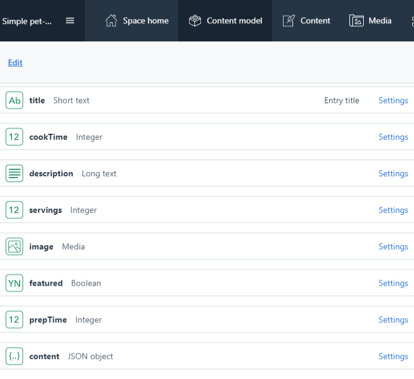

# GatsbyJS 3 (Static site generator)

### Simple pet-project generated using [gatsby-starter-hello-world](https://www.gatsbyjs.com/starters/gatsbyjs/gatsby-starter-hello-world/) starter

- ## [DEMO link of Front-end](https://gatsby-v3-hello-world.netlify.app/)
- ## [Back-end link](https://app.contentful.com/spaces) to Contentful with Hooks to Netlify

* [Gatsby 3.0](https://www.gatsbyjs.com)
* [Quick Start](https://www.gatsbyjs.com/docs/quick-start)
* [Gatsby Starters](https://www.gatsbyjs.com/starters/?v=3)
* [Hello world starter](https://www.gatsbyjs.com/starters/gatsbyjs/gatsby-starter-hello-world/)
* [Gatsby Plugin Library](https://www.gatsbyjs.com/plugins/)
* [gatsby-plugin-styled-components](https://www.gatsbyjs.com/plugins/gatsby-plugin-styled-components/?=styled)
* [Normalize.css](https://necolas.github.io/normalize.css/)
* [Figma Logo Creator Plugin](https://www.figma.com/community/plugin/768094929040207895/Logo-Creator)
* [React Icons Package](https://react-icons.github.io/react-icons/)
* [React Icons npm](https://www.npmjs.com/package/react-icons)
* [Responsive Images](https://developer.mozilla.org/ru/docs/Learn/HTML/Multimedia_and_embedding/Responsive_images)
* [Free Stock Photos](https://www.pexels.com/)
* [gatsby-plugin-image](https://www.gatsbyjs.com/plugins/gatsby-plugin-image/)
* [Gatsby Config API](https://www.gatsbyjs.com/docs/reference/config-files/gatsby-config/)
* [gatsby-source-filesystem](https://www.gatsbyjs.com/plugins/gatsby-source-filesystem/)
* [Using the Gatsby Image plugin](https://www.gatsbyjs.com/docs/how-to/images-and-media/using-gatsby-plugin-image/#dynamic-images)
* [gatsby-source-contentful](https://www.gatsbyjs.com/plugins/gatsby-source-contentful/)
* [Environment Variables](https://www.gatsbyjs.com/docs/how-to/local-development/environment-variables/)
* [File System Route API](https://www.gatsbyjs.com/docs/reference/routing/file-system-route-api/)
* [slugify npm package](https://www.npmjs.com/package/slugify)
* [Gatsby Node APIs](https://www.gatsbyjs.com/docs/reference/config-files/gatsby-node/)
* [gatsby-plugin-webfonts](https://www.gatsbyjs.com/plugins/gatsby-plugin-webfonts/?=webfonts)
* [React Helmet](https://www.npmjs.com/package/react-helmet)
* [gatsby-plugin-react-helmet](https://www.gatsbyjs.com/plugins/gatsby-plugin-react-helmet)
* [Importing and exporting content with the Contentful CLI](https://www.contentful.com/developers/docs/tutorials/cli/import-and-export/)

---

Requirements:

- [Node.js](https://nodejs.org/uk/)
- [Contenful](https://www.contentful.com) - add items (images, title, description)
- [Formspree](https://formspree.io) - contact form backend service
- [Netlify](https://www.netlify.com) - deploy project
- [Favicon](https://favicon.io/favicon-generator/)

---

### Run in terminal

```
npm i
```

### Or install Gatsby project manually:

```
npm i -g gatsby-cli
gatsby --version
npm install -g npm@7.10.0
gatsby new gatsby-starter-hello-world https://github.com/gatsbyjs/gatsby-starter-hello-world
gatsby clean
gatsby develop
```

### Check the result:

- [localhost:8000](http://localhost:8000)
- [localhost:8000/\_\_\_graphql](http://localhost:8000/___graphql)

### Open [Contentful](https://be.contentful.com/login)

- [create space](https://app.contentful.com/spaces/)
- go to => Content model => create content type: 
- go to => Content => add new item
- go to => Media => add new image

---

---

# Kick back & Relax

---

---

## Sample of GraphQL query

```
query {
  site {
    info: siteMetadata {
      title
      description
      author
      person {
        name
        age
      }
      simpleData
      complexData {
        name
        age
      }
    }
  }
}
```

---

## DATA storages:

- ### Local
  - [JSON](src/assets/data/recipe.json) => copy/paste to [Contentful](https://www.contentful.com) content JSON object
  - Markdown
  - MDX
- ### External
  - [Headless CMS](https://jamstack.org/headless-cms/) => [Contentful](https://www.contentful.com)

---

## Creating pages

- Manually
  - [homepage](./src/pages/index.js)
  - [about page](./src/pages/about.js)
  - [recipes page](./src/pages/recipes.js)
  - [tags page](./src/pages/tags.js)
  - [contact page](./src/pages/contact.js)
  - [404 page](./src/pages/404.js)
- Programmatically using Setting up in Gatsby-Node.js - tags pages
  template: [tag-template.js](src/templates/tag-template.js) & [gatsby-node.js](./gatsby-node.js) is an old way how to
  create pages
- Programmatically using Filesystem route API - recipes pages
  template: [{ContentfulRecipe.title}.js](./src/pages/%7BContentfulRecipe.title%7D.js)

```
cd pages
create file: {ContentfulRecipe.title}.js
```

```
cd src
create file: template/tag-template.js

cd /
create file: gatsby-node.js
```

---

# Contentful

- Content model - structure for a data
- Content types fields
  - rich text
  - text (title, description)
  - number (cookTime, servings, prepTime)
  - date & time
  - location
  - media (image)
  - boolean (featured)
  - JSON objects (content)
  - reference
- Add Webhook (Menu => Settings)

---

---

# Netlify

- Login
- Menu => [Sites](https://app.netlify.com/teams/****/sites)
  - Drag and drop your site output folder here
    - `gatsby clean && gatsby build`
    - drag & drop `public` folder
  - New site from Git
    - Create a new site
    - Connect to Git provider
    - Pick a repository
    - Show Advanced Build Settings => New Variable => `CONTENTFUL_API_KEY=h7a9U5luZ**********`
    - Site settings, and deploy!
    - Build & Deploy => Build Hooks => Add build hook => `https://api.netlify.com/build_hooks/608da*******` =>
      copy / paste to [Contentful](https://app.contentful.com/spaces) => Settings => Webhooks => save
      **(Netlify will restart the build after making some changes in Contentful)**

---

<!-- AUTO-GENERATED-CONTENT:START (STARTER) -->
<p align="center">
  <a href="https://www.gatsbyjs.com">
    
  </a>
</p>
<h1 align="center">
  Gatsby's hello-world starter
</h1>

Kick off your project with this hello-world boilerplate. This starter ships with the main Gatsby configuration files you
might need to get up and running blazing fast with the blazing fast app generator for React.

_Have another more specific idea? You may want to check out our vibrant collection
of [official and community-created starters](https://www.gatsbyjs.com/docs/gatsby-starters/)._

## 🚀 Quick start

1. **Create a Gatsby site.**

   Use the Gatsby CLI to create a new site, specifying the hello-world starter.

   ```shell
   # create a new Gatsby site using the hello-world starter
   gatsby new my-hello-world-starter https://github.com/gatsbyjs/gatsby-starter-hello-world
   ```

1. **Start developing.**

   Navigate into your new site’s directory and start it up.

   ```shell
   cd my-hello-world-starter/
   gatsby develop
   ```

1. **Open the source code and start editing!**

   Your site is now running at `http://localhost:8000`!

   _Note: You'll also see a second link: _`http://localhost:8000/___graphql`_. This is a tool you can use to experiment
   with querying your data. Learn more about using this tool in
   the [Gatsby tutorial](https://www.gatsbyjs.com/tutorial/part-five/#introducing-graphiql)._

   Open the `my-hello-world-starter` directory in your code editor of choice and edit `src/pages/index.js`. Save your
   changes and the browser will update in real time!

## 🧐 What's inside?

A quick look at the top-level files and directories you'll see in a Gatsby project.

    .
    ├── node_modules
    ├── src
    ├── .gitignore
    ├── .prettierrc
    ├── gatsby-browser.js
    ├── gatsby-config.js
    ├── gatsby-node.js
    ├── gatsby-ssr.js
    ├── LICENSE
    ├── package-lock.json
    ├── package.json
    └── README.md

1. **`/node_modules`**: This directory contains all of the modules of code that your project depends on (npm packages)
   are automatically installed.

2. **`/src`**: This directory will contain all of the code related to what you will see on the front-end of your site (
   what you see in the browser) such as your site header or a page template. `src` is a convention for “source code”.

3. **`.gitignore`**: This file tells git which files it should not track / not maintain a version history for.

4. **`.prettierrc`**: This is a configuration file for [Prettier](https://prettier.io/). Prettier is a tool to help keep
   the formatting of your code consistent.

5. **`gatsby-browser.js`**: This file is where Gatsby expects to find any usage of
   the [Gatsby browser APIs](https://www.gatsbyjs.com/docs/browser-apis/) (if any). These allow customization/extension
   of default Gatsby settings affecting the browser.

6. **`gatsby-config.js`**: This is the main configuration file for a Gatsby site. This is where you can specify
   information about your site (metadata) like the site title and description, which Gatsby plugins you’d like to
   include, etc. (Check out the [config docs](https://www.gatsbyjs.com/docs/gatsby-config/) for more detail).

7. **`gatsby-node.js`**: This file is where Gatsby expects to find any usage of
   the [Gatsby Node APIs](https://www.gatsbyjs.com/docs/node-apis/) (if any). These allow customization/extension of
   default Gatsby settings affecting pieces of the site build process.

8. **`gatsby-ssr.js`**: This file is where Gatsby expects to find any usage of
   the [Gatsby server-side rendering APIs](https://www.gatsbyjs.com/docs/ssr-apis/) (if any). These allow customization
   of default Gatsby settings affecting server-side rendering.

9. **`LICENSE`**: This Gatsby starter is licensed under the 0BSD license. This means that you can see this file as a
   placeholder and replace it with your own license.

10. **`package-lock.json`** (See `package.json` below, first). This is an automatically generated file based on the
    exact versions of your npm dependencies that were installed for your project. **(You won’t change this file
    directly).**

11. **`package.json`**: A manifest file for Node.js projects, which includes things like metadata (the project’s name,
    author, etc). This manifest is how npm knows which packages to install for your project.

12. **`README.md`**: A text file containing useful reference information about your project.

## 🎓 Learning Gatsby

Looking for more guidance? Full documentation for Gatsby lives [on the website](https://www.gatsbyjs.com/). Here are
some places to start:

- **For most developers, we recommend starting with
  our [in-depth tutorial for creating a site with Gatsby](https://www.gatsbyjs.com/tutorial/).** It starts with zero
  assumptions about your level of ability and walks through every step of the process.

- **To dive straight into code samples, head [to our documentation](https://www.gatsbyjs.com/docs/).** In particular,
  check out the _Guides_, _API Reference_, and _Advanced Tutorials_ sections in the sidebar.

## 💫 Deploy

[Build, Deploy, and Host On The Only Cloud Built For Gatsby](https://www.gatsbyjs.com/cloud/)

Gatsby Cloud is an end-to-end cloud platform specifically built for the Gatsby framework that combines a modern
developer experience with an optimized, global edge network.

<!-- AUTO-GENERATED-CONTENT:END -->
